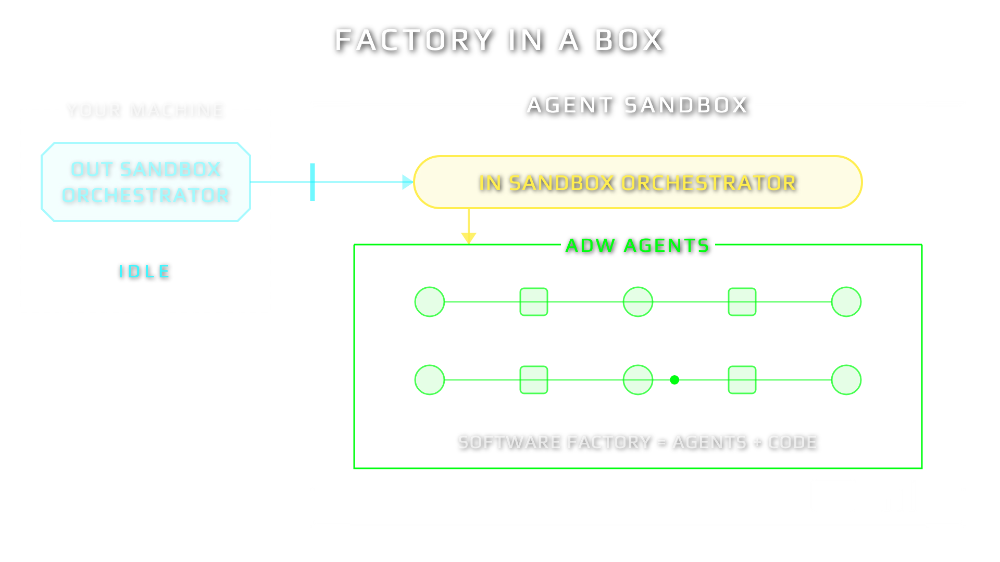
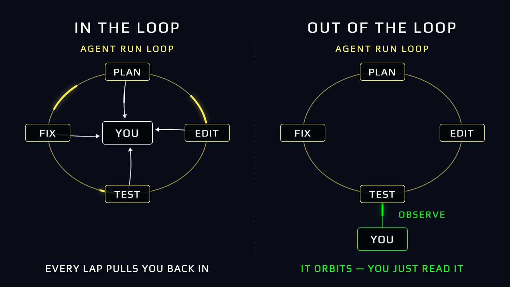
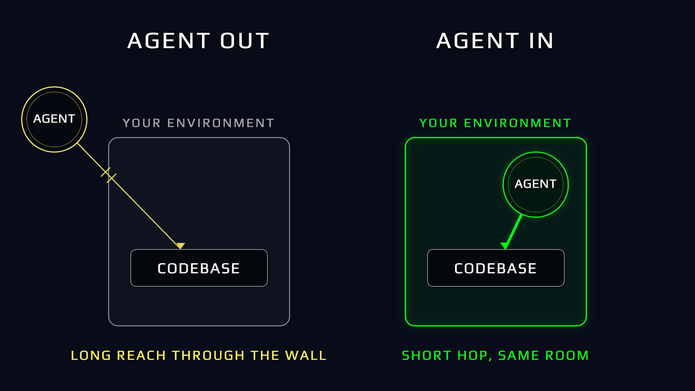
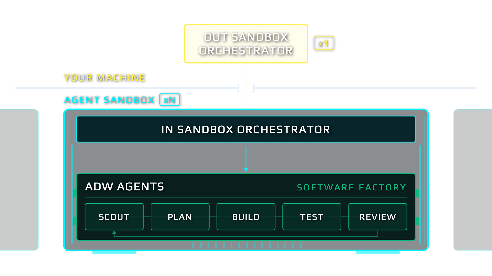
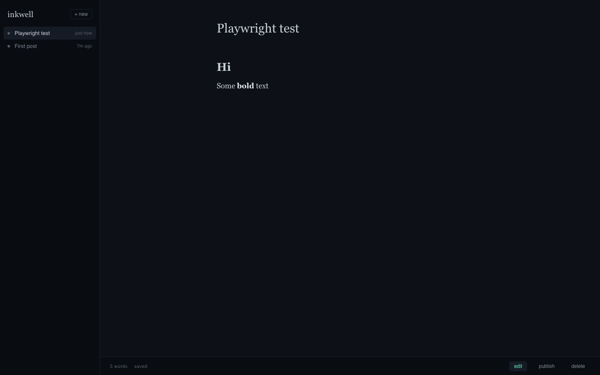
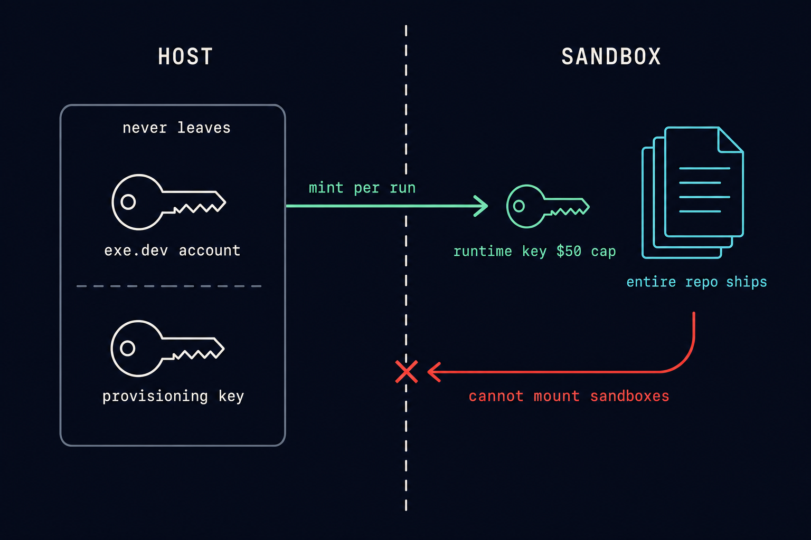
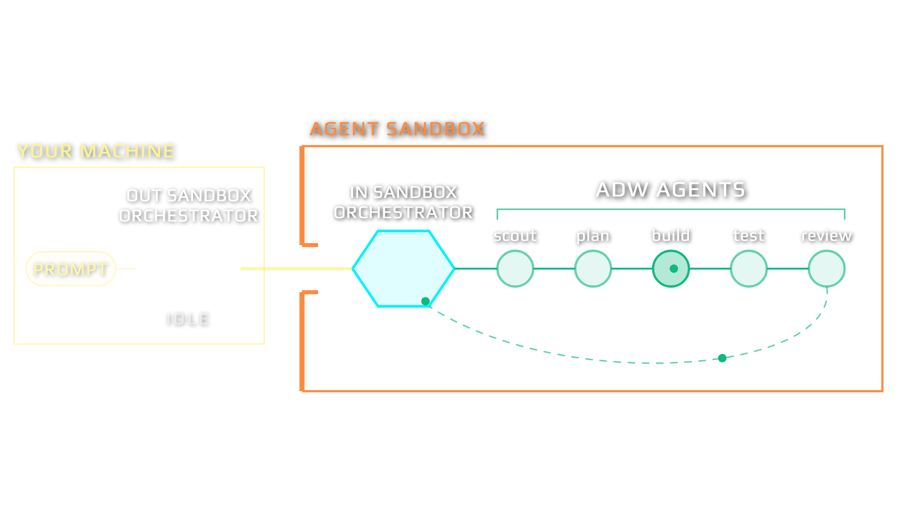
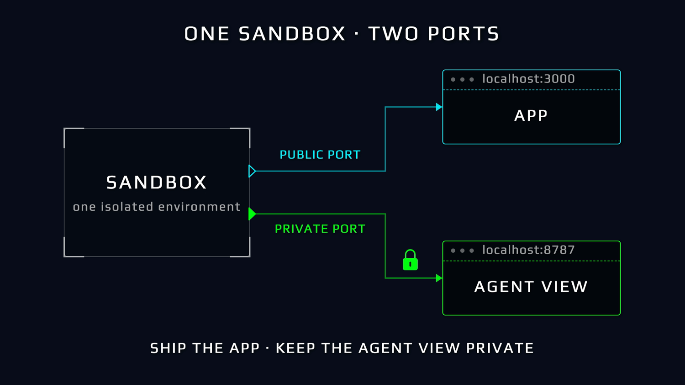

# Factory In A Box

> **A software factory: deterministic Python owns the graph, coding agents are bounded phases inside it.**
> For engineers who want agents shipping code without a human in the loop.

📺 Watch this video to get the full breakdown of this codebase: **[Factory In A Box on YouTube](https://youtu.be/SEI_qIW4o2c)**

<p align="center">
  
</p>

This repo holds **the factory** — the `/sssf` skill that stamps AI Developer
Workflows into any codebase, and the trace UI that shows you what they did. The
other two tiers it was built alongside now live on their own:

| tier | where | what it is |
|---|---|---|
| the payload | [`jeffjacobsen/inkwell`](https://github.com/jeffjacobsen/inkwell) | a blog app with this factory stamped in, and eight task prompts to point it at |
| **the factory** | **here** | the ADWs, the agent roster, the trace pipeline, the observability UI |
| the sandbox | [`jeffjacobsen/sbx`](https://github.com/jeffjacobsen/sbx) | mounts any repo onto a throwaway VM, installed once per machine |

**The point is the loop that ships code without you in the middle.**
[sbx's EXAMPLE.md](https://github.com/jeffjacobsen/sbx/blob/main/EXAMPLE.md) is
that loop on one real task: a blank VM, a prompt file, and 6.5 minutes later a
shipped feature for $1.96.

<p align="center">
  
</p>

---

## Install

### Agentic Install

```bash
claude               # boot Claude Code in the repo root
/install             # set up toolchain, deps, and .env, then run the preflight
/prime               # orient on all three tiers (out-loop orchestrator, in-loop orchestrator, software factory), check live state
```

`/install` and `/prime` live in `.claude/commands/`. `/install` checks the toolchain, verifies `.env`, and runs the `sbx manage doctor` preflight without starting anything. `/prime` then walks the agent through the command surface, the specs, and the measured gotchas.

Once oriented, you operate the whole system by talking to the agent. Two skills carry the knowledge, so you describe intent and the agent runs the right recipes:

- **`/sbx-orchestrator` (ships with [sbx](https://github.com/jeffjacobsen/sbx))** drives the out-of-sandbox loop from plain English: mount a box, put work in, watch it, fan out best-of-N, harvest the XYZ sandbox, tear down. Thin skill, fat recipes: every action it takes is a `just sbx` command you could type yourself.
- **`/sssf`** drives the factory: create, run, and observe the ADWs, and manage the agent roster. It is the product this repo ships — `/sssf install` stamps it into any codebase.
- **`/herdr`** multiplexes the terminals agents run in, so a fleet of them stays watchable from one place.

### Manual Install

```bash
cp .env.sample .env          # the key(s) your roster needs
uv run adws/adw_prompt.py "say hello" --agent scout    # one agent, one prompt
just obs sessions            # what just happened
```

### Required Tech

What the factory leans on, and what only matters once you want to run it on a
throwaway VM rather than your own machine:

| Tech | Role | Needed for |
|---|---|---|
| [`uv`](https://docs.astral.sh/uv/) | runs the PEP-723 Python ADW scripts | the factory |
| [`git`](https://git-scm.com) | the factory commits its own work | the factory |
| [`just`](https://just.systems) | the command surface | the factory |
| [`bun`](https://bun.sh) | serves the observability UI | the trace UI |
| [OpenRouter key](https://openrouter.ai/settings/keys) | the models the agents call | any run |
| [Claude Code](https://claude.com/claude-code) + [Pi](https://github.com/badlogic/pi-mono) | the coding agents themselves | running agents locally |
| [exe.dev account](https://exe.dev) + [provisioning key](https://openrouter.ai/settings/management-keys) | disposable VMs and their per-run capped keys | [sbx](https://github.com/jeffjacobsen/sbx) only |

### Running it on a throwaway VM

The factory runs fine on your own machine. To run it on a disposable VM instead —
which is what the rest of this README shows — install
[sbx](https://github.com/jeffjacobsen/sbx) once:

```bash
git clone https://github.com/jeffjacobsen/sbx ~/code/sbx
ln -s ~/code/sbx/bin/sbx /usr/local/bin/sbx
sbx manage doctor            # from any repo with a sandbox.yaml
```

> **Naming:** OpenRouter calls the provisioning key a **Management API key** and mints it at [`/settings/management-keys`](https://openrouter.ai/settings/management-keys). The ordinary [`/settings/keys`](https://openrouter.ai/settings/keys) page makes *inference* keys. Both look like `sk-or-v1-…`, so the prefix will not tell you which you have — `sbx manage doctor` asks OpenRouter and tells you before a VM exists.

Two credentials are the entire reason the sandbox is safe: the **exe.dev account** and the **OpenRouter provisioning key** live only on your host, and `sbx` keeps them in `~/.config/sbx/env` rather than in any repo. Everything else is a fast, free toolchain install.

---

## Why this exists

<p align="center">
  
</p>

A system that needs you at every step does not scale, and you become the key-man risk in your own factory. The goal is the right side of that diagram: the loop orbits, you read the trace. Isolation is what makes it safe to let go.

<p align="center">
  
</p>

The controversial call, stated plainly: **the coding agents run inside the sandbox**, not outside it driving a remote shell. Claude Code and Pi are installed on the VM, in the same room as the codebase. The host keeps only a thin orchestrator and two credentials that never leave.

---

## Who commands what

<p align="center">
  
</p>

Three command tiers, and each one commands only the tier inside it:

| Tier | Lives | Does |
| --- | --- | --- |
| **Out-sandbox super orchestrator** | your machine | mounts, fills, observes, harvests, tears down sandboxes |
| **In-sandbox orchestrator agent** | the VM, a resumable Claude Code session | receives delegated work, launches the factory, watches it, reports |
| **ADW agents** | bounded phases inside the factory | scout, plan, build, review, document |

<p align="center">
  
</p>

Work crosses the boundary on one of two paths, and the difference is who pulls the trigger inside:

| Path | Verb | Mechanism |
| --- | --- | --- |
| **Direct** | a command | `sbx lifecycle execute` detaches the factory process itself: reproducible, pid-tracked, zero orchestration tokens |
| **Agent-mediated** | a delegation | `sbx run agent` briefs the in-sandbox orchestrator, and *it* launches the factory: judgment at the kickoff, conversational, resumable |

Every delegation opens with the equip line, so the in-box agent routes instead of improvising:

```bash
sbx run agent <id> "If you have not already: READ and EXECUTE .claude/skills/sssf/SKILL.md. Then: <work>"
```

<p align="center">
  
</p>

---

## The payload lives elsewhere

<p align="center">
  
</p>

Inkwell — a blog-writing app in Bun and `bun:sqlite`, small enough to rebuild end
to end over and over by agents — moved to
[`jeffjacobsen/inkwell`](https://github.com/jeffjacobsen/inkwell) with this
factory stamped into it. That is the point rather than an accident: a factory
that can only build the app sitting next to it is not a factory. The demo target
is a URL, and `/sssf install` puts the factory into any repo the same way.

## The factory

<p align="center">
  
</p>

Twelve ADWs (AI Developer Workflows) under `adws/`, each a thin `uv run` script whose docstring is its chain: `adw_simple_sdlc` runs plan, build, test, review, document with three separate commits. Typed envelopes carry context between phases; gates validate every claim, and a failure re-enters the same session as a correction, never a restart. **Agent proposes, code disposes.**

<p align="center">
  
</p>

Under every phase is the same primitive: an agent is a model, a harness, tools, and a prompt. The factory holds those four constant and swaps only the prompt and the model per phase. Staffing is one config file, swappable per run: five rosters ship in `adws/adw_sssf_config/`, the cheap default, the frontier roster, pure DeepSeek, open-weights, and top-speed. Every model is `openrouter/<id>`, so the ids are identical on your laptop and inside every box.

The factory is the skill at `.claude/skills/sssf/` — `/sssf install` stamps it into any repo, and it carries its own documentation. It originated as [disler/super-simple-software-factory](https://github.com/disler/super-simple-software-factory), which is also where several of these workflows are explained on video: [Super Simple Software Factory](https://youtu.be/haUfb1ievTE).

## The sandbox

<p align="center">
  
</p>

[**sbx**](https://github.com/jeffjacobsen/sbx) takes a blank exe.dev VM to a
health-checked, running factory in about ten measured seconds, then serves it on
a public URL. It is installed once per machine rather than copied into each
repo, because `reap` and `manage list` reason about a whole account — a copy per
repo gives one partial view per repo, and a key can hide in the gap.

Each run gets a disposable `sbx-` credential with a spend cap, revoked at
teardown, and the exe.dev account and provisioning key never leave your host.
**One level of nesting, enforced by credentials rather than by deleting files.**
A repo says how it wants to be run in one `sandbox.yaml`; this repo has one, and
so does Inkwell.

## How to run it end to end

<p align="center">
  
</p>

The main flow, top to bottom. `sbx …` comes from
[sbx](https://github.com/jeffjacobsen/sbx), installed once per machine; `just …`
is this repo. Run it from whichever repo you are mounting — Inkwell, or any repo
with a `sandbox.yaml`.

```bash
# 0. one-time: credentials + preflight
printf 'OPENROUTER_PROVISIONING_KEY=…\n' > ~/.config/sbx/env && chmod 600 ~/.config/sbx/env
sbx manage doctor            # must end with: sbx doctor: OK

# 1. mount a throwaway VM into a running factory (~10s)
sbx mount my-feature         # prints the resolved run id and two URLs

# 2. put work in (pick one path)
sbx lifecycle execute <run-id> "add a word-count badge to the editor footer"   # direct, detached
sbx run agent       <run-id> "READ and EXECUTE .claude/skills/sssf/SKILL.md. Then: <work>"  # delegated

# 3. watch from outside
sbx manage list              # every run: state, VM alive, spend
just obs sessions                 # the ADW runs inside your boxes
just obs tail <adw_id>            # live event stream for one run

# 4. bring the commits home (safe, non-destructive, run any time)
sbx manage harvest <run-id>  # commits land in refs/sandbox/<run-id>

# 5. tear it down (always an explicit human decision)
sbx lifecycle teardown <run-id>
```

Or just ask. With `/sbx-orchestrator` (ships with [sbx](https://github.com/jeffjacobsen/sbx)) loaded, the same flow runs conversationally: "mount a sandbox and add a word-count badge," "spin up three and give me best-of-N," "harvest the winner." The skill picks the recipes; the typed `just` commands above stay the deterministic ground truth underneath.

Two handles, do not confuse them: **`<run-id>`** names the sandbox (it is also the VM name and the public hostname), while **`<adw_id>`** names one factory run inside that box. `sbx manage list` counts sandboxes; `just obs sessions` counts the runs within them. A single box can host many ADW runs.

`sbx mount` stops at `observe` on purpose: nothing chains into teardown, because a destroyed VM is the evidence and the artifacts, gone. Harvest is the exception you can run freely, because it only reads the box and only writes `refs/sandbox/`.

---

## Watch it run

<p align="center">
  
</p>

You watch from outside; you never reach in. Every phase, tool call, complete thought, and complete response streams into `sssf.db` as it happens (agents to sqlite to you, WAL so reads never block writers), and the visualizer polls it.

<p align="center">
  
</p>

Every run is recorded, and the record outlives the box that produced it:
`teardown` harvests each run's `sssf.db` home, so this repo can open **any run
the fleet has ever produced**, long after its VM is destroyed.

```bash
just obs sessions                              # this repo
just obs sessions fts5-search-20260811-984a34  # a harvested run, from anywhere
just obs ui  fts5-search-20260811-984a34       # the trace UI on that run
```

<p align="center">
  
</p>

Each sandbox exposes two ports: the app is public, the agent view stays auth-gated to you. Ship the app; keep the factory floor private.

```bash
just obs ui [run-id]        # boot the observability UI on this repo or any run
just obs tail <adw_id>      # live event tail
just obs phases <adw_id>    # phase status in sequence
sbx manage list             # every sandbox: state, VM alive, spend
```

---

## The command surface

Three namespaces, and the namespace answers *where the work happens*:

```
justfile
├── adw         the workflows: sdlc, build-test, scout, simple-sdlc …
├── obs         read the trace, from this repo or any harvested run
└── local       boot an orchestrator agent on THIS machine: cc / pi / ipi
```

Sandbox orchestration is not a namespace here any more — it is `sbx`, a separate
command. Two handles, easy to confuse: **`<run-id>`** names a sandbox (it is also
the VM name and the public hostname), while **`<adw_id>`** names one factory run
*inside* that box. `sbx manage list` counts sandboxes; `just obs sessions` counts
the runs within them, and a single box can host many.

`TREE.md` is the file-by-file map of the repo, if you want the full territory.

---

## Where it can still fail

Every one of these was measured on live hardware, and each cost a debugging cycle:

- **`pi --list-models` exits 0 while printing "No models available."** Health checks assert on output, never `$?` — and the sandbox gate rejects that exact string by name.
- **A partial cost block drops the whole roster.** pi requires all four rate fields; miss one and every run reports $0.0000 while genuinely spending. A 463.6k-token run logged `$0.0000` before this was caught.
- **A model id that does not resolve fails the first agent call, ~80s in.** The roster ping catches it at mount instead. A planner once pointed at a Fireworks provider path where an OpenRouter id belonged.
- **Customising by editing a stamped file is a fork.** `run_tests` was once renamed to `run_inkwell_tests`; three ADWs kept calling the old name and died at the *tail* of each chain, ~$0.96 in. Commands live in the `quality:` block of `sssf.config.yaml`; `/sssf install --check` reports drift.

The mount-side traps — `apt` in the provision path, zero-byte golden clones, just's
module scoping — live in [sbx's README](https://github.com/jeffjacobsen/sbx#where-it-can-still-fail).

---

## License

MIT — see [`LICENSE`](LICENSE).

---

## Credits

This project is built on [inkwell-agent-sandboxes-and-software-factory](https://github.com/disler/inkwell-agent-sandboxes-and-software-factory) by **IndyDevDan** ([@disler](https://github.com/disler)) — the original repo, and the source of the three-tier design, the ADW model, and the sandbox mount system this repo grew from.

---

## Tactical Agentic Coding by IndyDevDan

Want to a clear hands on guide to building your software factory?

Master tactical agentic coding patterns with [Tactical Agentic Coding](https://agenticengineer.com/tactical-agentic-coding?y=fctinbox).

Don't want to pay for stuff? No problem: Follow the [IndyDevDan YouTube channel](https://www.youtube.com/@indydevdan) to improve your agentic coding advantage.

---

Stay Focused and Keep Building

- IndyDevDan
